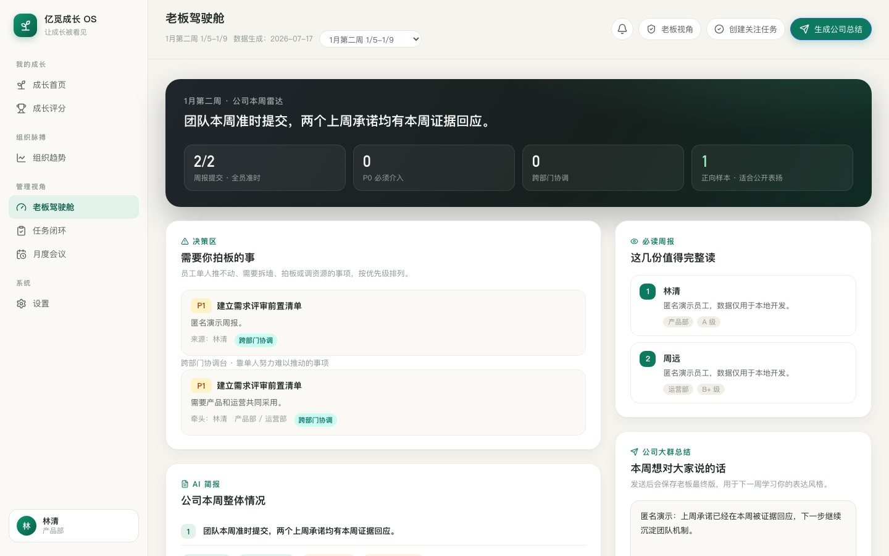
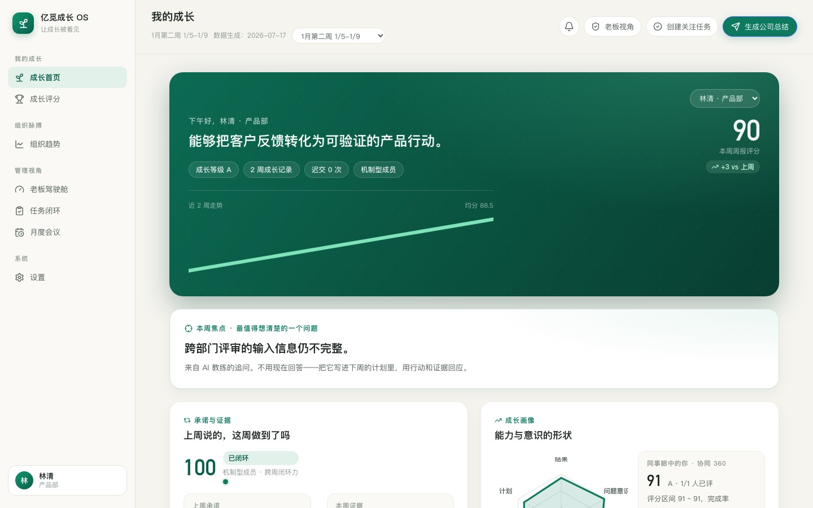

# 亿觅成长 OS

> 把周报从一次性的“汇报动作”，变成个人成长轨迹、组织问题雷达和现实任务闭环。

[](https://github.com/brotherjean/emie-growth-os/actions)


亿觅成长 OS（EMIE Growth OS）是一套围绕**周报、成长分析、管理注意力排序和任务闭环**构建的 AI 原生组织工作系统。它读取飞书汇报或 Excel 导出数据，将分散的工作记录组织成可追溯的周期上下文，再通过 AI 分析、人工确认、飞书任务与提醒，把“发现问题”推进到“完成行动、验证结果、沉淀机制”。

它最初源于一个真实的管理问题：扁平组织里，老板很难每周完整阅读数十份周报、记住跨周承诺，并判断哪些事项真正需要自己介入。系统因此不以“生成更多点评”为目标，而以**帮助管理者排序注意力、帮助员工看见成长、帮助组织持续完成闭环**为核心。

> **公开仓库说明**：本仓库只包含代码、匿名演示数据和脱敏截图。真实员工身份、周报正文、AI 分析、互动记录、SQLite 数据库、上传文件、API Key 与部署凭据均不进入 Git。

## 项目价值

### 对员工：看见自己的成长轨迹

- 回看每周周报、评分趋势、能力变化与历史承诺。
- 获得以鼓励为主的 AI 点评、教练式提问和成长建议。
- 对照“上周计划 -> 本周证据”，判断任务是否真正闭环。
- 把模糊问题拆成可编辑、可执行、可验证的任务候选。

### 对管理者：只看真正需要介入的事情

- 从数十份周报中识别 P0/P1 风险、跨部门阻塞和必须完整阅读的报告。
- 按部门和周期观察重复问题、闭环进展、协同关系与机制沉淀。
- 将员工单靠个人努力难以推动的事项汇入管理注意力队列。
- 生成公司总结草稿，在人工编辑确认后通过飞书触达团队。

### 对组织：把互动沉淀为下一次分析的上下文

- 周报、评论、追问、任务状态和协同评分共同构成组织记忆。
- 任务创建不是终点；问题被解决并形成可复用机制才算闭环。
- 周会、月会可以从结论跳回事实依据，持续比较跨周、跨月变化。
- 在控制权限和保留人工判断的前提下，让 AI 逐步理解现实约束。

## 产品演示

演示环境使用虚构员工与匿名内容，不连接真实飞书，也不会发送消息或创建任务。

### 老板驾驶舱：管理注意力排序



老板驾驶舱把公司级结论、需要拍板的问题、跨部门协调、必读周报和可发送总结放在同一个决策工作区。管理者不需要逐份翻阅全部文本，而是先处理最重要的少数问题，再下钻查看证据。

### 个人成长：从周报评分到跨周闭环



个人页同时保留长期成长趋势与当周行动：历史周报和评分用于观察变化，当周 AI 提问、任务候选和协同反馈用于推动下一步。员工可以看到自己说过什么、做到了什么，以及哪些问题仍在重复出现。

## 主要功能

| 模块 | 解决的问题 | 当前能力 |
|---|---|---|
| 个人成长 | 周报写完即消失，员工看不到长期变化 | 历史周报、评分趋势、成长雷达、AI 点评、教练提问、承诺闭环 |
| 老板驾驶舱 | 信息过载，重要事项淹没在周报正文中 | 公司简报、P0/P1 队列、跨部门协调、必读周报、总结草稿 |
| 任务闭环 | “提出问题”被误认为“解决问题” | AI 拆解任务、人工编辑、飞书任务创建、状态/评论回传、跨周追踪 |
| 组织趋势 | 重复问题与优秀机制难以跨人、跨周识别 | 部门质量、主题聚类、闭环力、机制样本、组织贡献观察 |
| 月度会议 | 月会缺少结构化议程和事实跳转 | 公司与部门议题、问题分类、跨月对照、决议与后续任务 |
| 协同 360 | 协作价值和组织孤岛不易被看见 | 评分关系配置、周期任务、滚动得分、提醒与管理看板 |
| 飞书集成 | 分析与日常沟通、执行系统脱节 | SSO、通讯录、汇报读取、消息提醒、任务创建、事件回调 |
| 运行审计 | 自动化失败后难以及时发现 | 同步状态、通知 outbox、幂等发送、活跃日志、授权预警与巡检 |

## 从飞书到现实闭环


AI 管线采用“**分块分析 + 跨周上下文 + 结构化校验 + 人工确认**”的方式：

1. **事实层**：按人员、部门、周期保存汇报内容和任务状态，不覆盖历史快照。
2. **分析层**：分别生成员工点评、任务候选、主题聚类和管理摘要，避免一次长输出破坏结构。
3. **合并层**：将本周增量与历史承诺、重复问题、已创建任务进行比对。
4. **行动层**：任务标题、正文、衡量指标和证据都可由人编辑后再写入飞书。
5. **反馈层**：评论、追问、任务进度和最终发送文案成为下一周期的上下文。

## 系统架构

```text
飞书汇报 / Excel
        │
        ▼
导入与周期化归档 ──> Kimi 分块分析 ──> 跨周合并与校验
        │                                      │
        ▼                                      ▼
匿名演示数据 / 生产运行数据              个人、部门、公司洞察
        │                                      │
        └──────────────> React 前端 <──────────┘
                                │
                                ▼
                         Node API + SQLite
                                │
                                ▼
                   飞书 SSO / 消息 / 任务 / 回调
```

代码目录：

- `src/`：React 前端、页面、数据映射和展示规则。
- `server/`：SSO、权限、互动、任务、通知、360 与运行日志 API。
- `scripts/`：汇报导入、AI 预处理、周期快照、静态发布和自动化任务。
- `db/schema.sql`：SQLite 运行数据结构。
- `docs/`：项目历史、现状、协作规则、设计说明与脱敏截图。
- `src/data/`：仅允许提交虚构演示数据和中国工作日日历。

## 技术栈

- **Frontend**：React 19、TypeScript、Vite、Lucide Icons
- **Backend**：Node.js、原生 HTTP API
- **Runtime data**：SQLite
- **AI orchestration**：Kimi，多阶段提示词、结构化 JSON、跨周期上下文与校验
- **Enterprise integration**：飞书 SSO、通讯录、汇报、消息、任务、事件回调
- **Delivery**：静态构建 + Node API；生产数据与代码仓库分层

## 本地运行

```bash
git clone https://github.com/brotherjean/emie-growth-os.git
cd emie-growth-os
npm ci
npm run build
npm run dev
```

默认演示模式不需要任何密钥。浏览器访问终端输出的本地地址即可。

如需同时启动本地 API：

```bash
npm run server:dev
```

如需接入自己的飞书与模型服务，请复制 `.env.example` 并使用自己的测试应用。不要在公开 Issue、PR、日志或截图中提交真实凭据与员工数据。

## 开发验证

提交 PR 前至少执行：

```bash
npm run build
node scripts/test-closure-insights.mjs
node scripts/test-scoring360-policy.mjs
```

修改 AI 静态数据结构时，再执行：

```bash
npm run static:validate
```

## 数据与安全边界

本仓库不是生产数据库备份，也不是员工数据共享渠道。

| 数据类型 | 是否进入公开仓库 |
|---|---|
| React、Node、脚本、schema、匿名 fixture | 是 |
| `.env.example` 与无效默认配置 | 是 |
| API Key、App Secret、token、SSH 私钥 | 否 |
| 周报正文、评论、AI 对话、360 明细 | 否 |
| SQLite、Excel、CSV、outbox、访问日志 | 否 |
| 生产构建、服务器备份与身份映射 | 否 |

详细边界见 [安全说明](SECURITY.md)。

## 参与开发

1. Fork 仓库，或从 `main` 创建 `feature/...`、`fix/...`、`analysis/...` 分支。
2. 每个 PR 只解决一个明确问题，并说明影响范围与回滚方式。
3. 提供构建、测试或截图证据，确认没有真实数据与凭据。
4. 由维护者审阅后决定是否合并、是否进入生产发布。

完整规则见 [协作开发指南](CONTRIBUTING.md) 和 [访问与审阅流程](docs/ACCESS_AND_REVIEW.md)。项目演进与当前边界见 [项目历史](docs/PROJECT_HISTORY.md) 和 [项目现状](docs/PROJECT_STATUS.md)。

## 路线图

- 稳定周报、任务、互动、评分和组织架构的数据模型。
- 增强“上周计划 -> 本周证据”的闭环匹配与机制沉淀判断。
- 将业务、财务、ERP、Base 和一线事实纳入月度经营复盘。
- 完善部门 Leader 会议视角、权限与主动闭环工具。
- 支持员工补充语音反思与工作成果附件。
- 建立更完整的 CI、秘密扫描与生产 release gate。

## 授权说明

本仓库当前公开用于阅读、内部协作与技术交流，**尚未附加开源许可证**。公开可见不等于授予复制、分发或商业使用权。如需在其他组织或商业项目中使用，请先联系仓库所有者。

---

## English Summary

**EMIE Growth OS** turns weekly reports into personal growth trajectories, organizational issue radar, and real-world execution loops. It integrates Feishu reports, Kimi-powered multi-stage analysis, human review, task creation, reminders, collaboration scoring, and cross-period evidence tracking.

The system is designed around one principle: AI should not merely write more comments. It should help people identify what matters, convert vague issues into verifiable actions, and preserve execution feedback as context for the next cycle.

This public repository contains only source code, anonymized demo fixtures, and sanitized screenshots. Production employee data, report text, AI outputs, credentials, databases, and deployment artifacts are excluded.

### Core capabilities

- Personal growth timeline and commitment-to-evidence tracking
- Executive attention queue and cross-department issue triage
- Editable AI task candidates with Feishu task synchronization
- Organizational trends, monthly review agendas, and Collaboration 360
- Feishu SSO, messaging, task callbacks, reminders, and audit logs
- Local or server-side preprocessing with static release generation

See the Chinese sections above for architecture, setup, security boundaries, and contribution guidelines.
